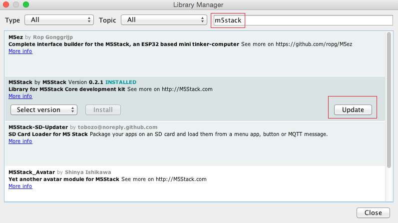
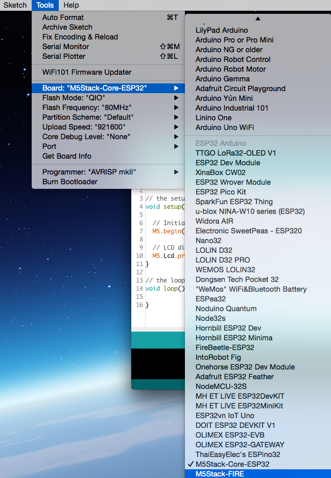
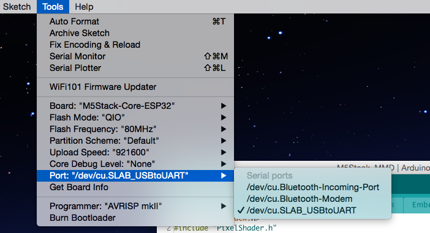
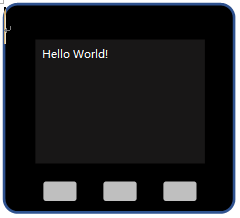
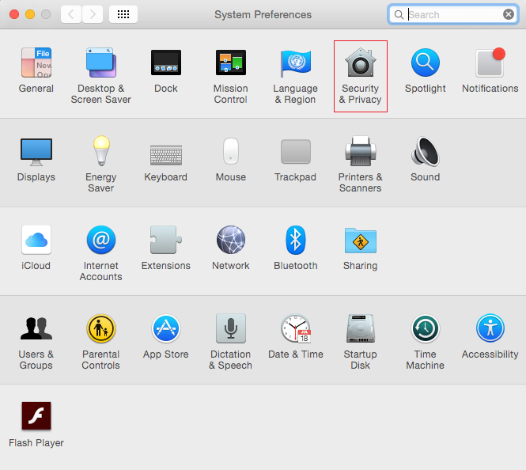

# M5Stack-Core Get Started(macOS, Arudino)

### CONTENT

1. [Setting Environment](#setting-environment)

    - [1. Install Arduino IDE](#1-install-arduino-ide)

    - [2. ESP32 Board Support](#2-esp32-board-support)

    - [3. Install M5Stack Lib](#3-install-m5stack-lib)

2. [Example](#example)

### Setting Environment

*Before setting the development environment, we suggest you confirm whether the USB driver has installed. If not, please visit this link `establish serial connection`.* TODO: add a link

#### 1. Install `Arduino IDE`

First, if Arudino IDE is not installed, install it. It's *download address* is 
https://www.arduino.cc/en/Main/Software 


#### 2. ESP32 Board Support

Open Terminal and execute the following command (copy->paste and hit enter):

```

mkdir -p ~/Documents/Arduino/hardware/espressif && \
cd ~/Documents/Arduino/hardware/espressif && \
git clone https://github.com/espressif/arduino-esp32.git esp32 && \
cd esp32 && \
git submodule update --init --recursive && \
cd tools && \
python get.py

```

Where ~/Documents/Arduino represents your sketch book location as per "Arduino" > "Preferences" > "Sketchbook location" (in the IDE once started). Adjust the command above accordingly if necessary!

**Note:**
If you get the error below: `xcrun: error: invalid active developer path (/Library/Developer/CommandLineTools), missing xcrun at: /Library/Developer/CommandLineTools/usr/bin/xcrun`, install the command line dev tools with `xcode-select --install` and try the command above again and restart Arduino IDE.

If you get the error: `IOError: [Errno socket error] [SSL: TLSV1_ALERT_PROTOCOL_VERSION] tlsv1 alert protocol version (_ssl.c:590) when running python get.py`, try `python3` instead of `python` and restart Arduino IDE.


#### 3. Install M5Stack Lib

Start up Arduino IDE, then Select `Sketch`->`Include Library`->`Manage Libraries...`
Type `M5Stack` into the search box, search it and install.





### Example

The USB cable connects to M5Stack Core, then select your serial port which is connected M5Stack Core.
Select a demo example, compile and upload

#### 1. Select your board and the serial port

Start up Arduino IDE, and click `Tools -> Boards -> M5Stack-Core-ESP32` to select your board



Click `Tools -> Ports ->` to select the serial port which is connected with M5Stack Core



### 2. Select an example

Click `File-> Examples`. Here are some test programs in `M5Stack->`

Try to open a sketch called `HelloWorld` inside Basics.


Compile it and upload, the M5Stack screen will show "Hello World!"




### Note

Although there was no problem in my environment, sometimes Slab_USBtoUART does not appear in some cases.
In this case, open `security and privacy` in the system preferences and set it to `permit`.




