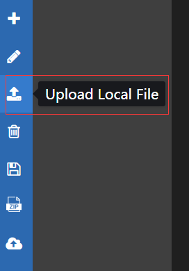

# M5Stack StepMotor Module

Now, we consident that you can program M5Stack Core with M5Cloud. If not, please read the article [Getting Started with MicroPython](www.baidu.com)

### Quick Start

##### 1. M5Stack Core connect with StepMotor Module, then click `Upload Local File` for adding two necessary files `motor.py`, `i2c_bus.py` as shown below




##### 2. Copy the below code to `main.py`, upload all file and `run`

```python

from m5stack import lcd
import motor
import utime

lcd.clear()
lcd.setCursor(0, 0)
lcd.setColor(lcd.WHITE)
lcd.print("StepMotor Test: ")

stepmotor_0 = motor.StepMotor(0x70)

stepmotor_0.StepMotor_XYZ(0, 0, 0, 500)
utime.sleep(3)
stepmotor_0.StepMotor_XYZ(10.5, 10.5, 10.5, 500)
utime.sleep(3)
stepmotor_0.StepMotor_XYZ(0, 0, 0, 500)

```

*Note: When step motor is running, supply it with 12V power.*


