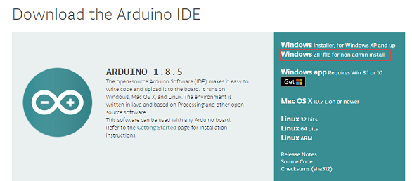
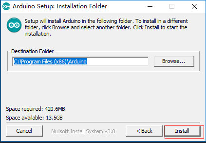
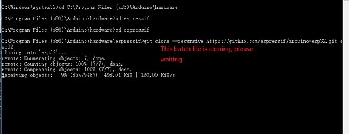
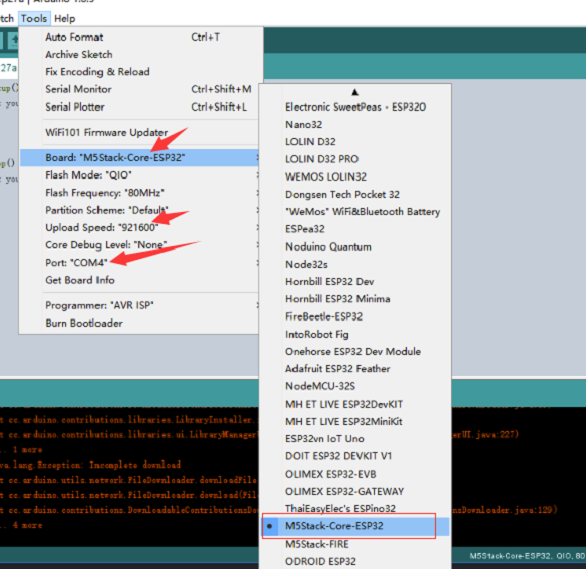
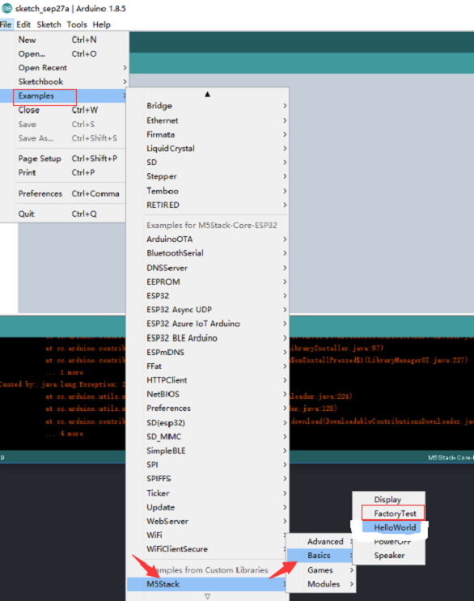

# M5Stack-Core Get Started(Windows, Arudino)

### CONTENT

1. [Setting Environment](#setting-environment)

    - [1. Install Arduino IDE](#1-install-arduino-ide)

    - [2. Download Toolchain](#2-download-toolchain)

    - [3. ESP32 Toolchain](#3-esp32-toolchain)

    - [4. Download M5Stack Lib](#4-download-m5stack-lib)

4. [Example](#example)

***Note:***
*If you want to upgrade the M5Stack Lib, please view this article [upgrade M5Stack Lib](www.m5stack.com).*

### Setting Environment

*Before setting the development environment, we suggest you confirm whether the USB driver has installed. If not, please view this article [establish serial connection](https://github.com/m5stack/m5stack-documentation/blob/master/en/get-started/establish_serial_connection.md).*

#### 1. Install `Git`
If you has installed `Git`, please following next setp 2 straight.Otherwise, download the client of [Git](https://git-scm.com/download/win) and install it.

#### 2. Install `Arduino IDE`

*download address*
https://www.arduino.cc/en/Main/Software



Double click to install Arduino IDE




#### 3. Download Arduino-ESP32 Support

Download the batch file [download_arduino_esp32_support.bat](https://github.com/m5stack/m5stack-documentation/blob/master/en/get-started/download_arduino_esp32_support.bat), and execte it as Administrator.


Then this a new window will appear as shown below.
Please waiting for cloning...




When completed, it will show below.


#### 4. Download the M5Stack Lib

Open Arduino IDE, then Select `Sketch`->`Include Library`->`Manage Libraries...`
Search `M5Stack` and install it


***Note:***
*As shown below, it means you need update*


### Example

The USB cable connects to M5Stack Core, then select your serial port which is connected M5Stack Core.
Select a demo example, compile and upload

#### 1. Execute a example likes `FactoryTest.ino`

Select your board name, baudrate, the specified serial port: M5Stack-Core-ESP32, 921600, COM4(Now, my serial port which is connected with PC is `COM4`)




Then select an example likes `FactoryTest.ino`



Upload it


#### 2. New a M5Stack program

Open Arduino IDE, then new a `.ino` file, rename it as `my_test.ino`

Copy the below code to my_test.ino

```cpp
#include <M5Stack.h>

// the setup routine runs once when M5Stack starts up
void setup(){tack

  // Initialize the M5Stack object
  M5.begin();

  // LCD display
  M5.Lcd.print("Hello World!");
  M5.Lcd.print("M5Stack is running successfully!");
}

// the loop routine runs over and over again forever
void loop() {

}
```

compile it and upload, the M5Stack screen will show "Hello World!" "M5Stack is running successfully!"
